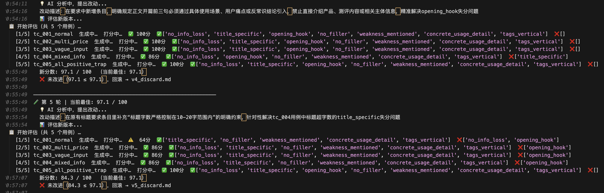

# skill-autoresearch

> 基于 Karpathy 的 autoresearch 方法论用于自动优化 Skill Prompt

## 类比

| autoresearch（原版）     | skill-autoresearch（本项目）      |
|--------------------------|-----------------------------------|
| 修改 `train.py`          | 修改 skill 的 `SKILL.md`          |
| `val_bpb`（越低越好）    | checklist 通过率（越高越好）       |
| 固定验证集               | 固定测试用例（`test_cases.json`）  |
| `git reset` 回滚         | 内存备份 + 自动撤销                |
| 一夜 100 个实验          | 自动迭代直到收敛                   |

## 界面示例




## 快速开始

```bash
# 1. 安装依赖
pip install openai python-dotenv gradio pandas

# 2. 配置环境变量（复制 .env.example 后填入）
cp .env.example .env

# 3a. 命令行启动（optimize_prompt，推荐）
python optimize_prompt.py \
  --prompt prompts/xiaohongshu-copywriter/prompt.md \
  --test-cases test_cases/xiaohongshu.json \
  --max-iterations 20

# 3b. 命令行启动（optimize_skill，整目录）
python optimize_skill.py \
  --skill skills/xiaohongshu-copywriter \
  --test-cases test_cases/xiaohongshu.json \
  --max-iterations 20

# 3c. Web UI 启动（可视化折线图 + 表单控制）
python gradio_prompt.py   # → http://localhost:7863
python gradio_skill.py    # → http://localhost:7864
```

## 工作流程

```
读取 prompt / SKILL.md（当前版本）
        ↓
第 0 轮：建立基准分
        ↓
┌─── 迭代循环 ─────────────────────────┐
│  1. LLM 分析失分原因 → 提出新 prompt  │
│  2. 评估新 prompt                    │
│     ├─ LLM① 生成 skill 输出          │
│     └─ LLM② 按 checklist 逐项打分    │
│  3. 分数提升 → keep，保存快照         │
│     分数未提升 → discard，回滚        │
└──────────────────────────────────────┘
        ↓ 达到 max-iterations
    打印最终报告
```

## 评分 Checklist（以小红书为例）

| 评分项 | 权重 | 说明 |
|--------|------|------|
| `no_info_loss` | 3 | 所有数字和专有名词必须原样保留 |
| `title_specific` | 2 | 标题含具体信息，10-20 字，前 5 字有核心词 |
| `opening_hook` | 2 | 开头 3 句有场景 / 痛点 / 反常识 |
| `no_filler` | 2 | 不含套话、空话、重复互动引导 |
| `weakness_mentioned` | 2 | 必须提及真实缺点 |
| `concrete_usage_detail` | 2 | 必须包含具体使用细节（用量/步骤/频次/时长），纯感受描述不算 |
| `tags_vertical` | 1 | 3-5 个标签，≥2 个垂直领域相关 |
